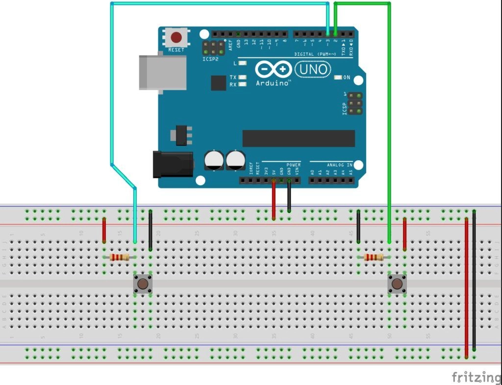

# Pulsera control para la Salud Mental

## Diseño de la pulsera

En primer lugar, vamos a ver como podemos recoger una salida digital que nos da un botón en Arduino, para ello debemos conectar una de las patillas a la entrada de 5V, a una resistencia y a la salida digital que queramos capturar (imagen de la izquierda):

Vamos a necesitar 4 botones ya que se nos piden 4 estados (solo tenemos dos botones):

- Estoy teniendo una crisis
- Siento que la medicación no me está yendo bien
- Tengo pensamientos suicidas (SOS)
- Fallo en la protección
